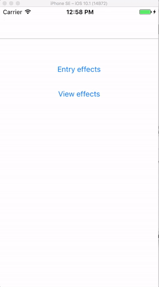
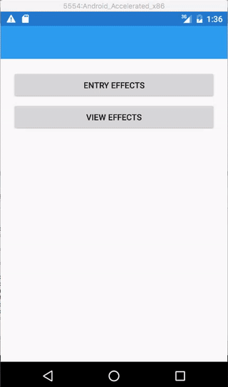

# EntryCapitalizeKeyboard effect

The **EntryCapitalizeKeyboard** effect enforces caps on the keyboard for an `Entry` control.

## Syntax

You can either use the `CapitalizeKeyboard` effect from your XAML code:

```xaml
<Entry Placeholder="start typing..." VerticalOptions="Start">
    <Entry.Effects>
    <effects:EntryCapitalizeKeyboard />
    </Entry.Effects>
</Entry>
```

or directly from code:

```csharp
MyEntry.Effects.Add(Effect.Resolve("FormsCommunityToolkit.Effects.EntryCapitalizeKeyboard"));
```

[CapitalizeKeyboardEffect Sample Page Source](https://github.com/FormsCommunityToolkit/Effects/blob/master/samples/Effects.SampleApp/Views/EntryPage.xaml)

## Example Image

iOS



Android 



## API source code

* [Android source code](https://github.com/xamarin/XamarinCommunityToolkit/blob/dev/src/Effects/Effects/Platforms/Android/Entry/EntryCapitalizeKeyboard.cs)
* [iOS source code](https://github.com/xamarin/XamarinCommunityToolkit/blob/dev/src/Effects/Effects/Platforms/iOS/Entry/EntryCapitalizeKeyboard.cs)
* [UWP source code](https://github.com/xamarin/XamarinCommunityToolkit/blob/dev/src/Effects/Effects/Platforms/UWP/Entry/EntryCapitalizeKeyboard.cs)